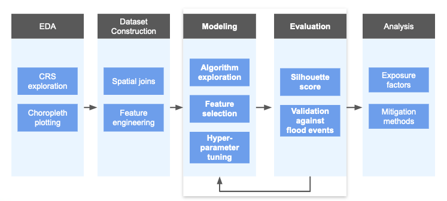
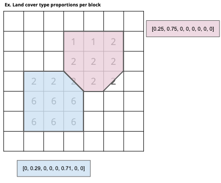
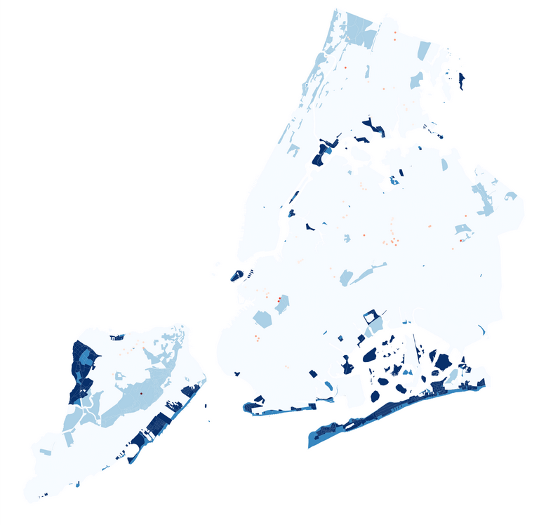

# FloodWise

Climate change is having an increasingly frequent and significant impact as a result of worsening storm severity and rising sea levels.
Cities are especially vulnerable to flooding during these storms because of the high proportions of impervious ground cover.

## Goals
- Combine data sources to create a comprehensive geospatial dataset for pilot city, New York
- Identify features tied to flood risk; map risk levels at census block granularity
- Recommend measures to mitigate risk and severity of flooding
- Estimate resulting impact

## Process

## Feature Engineering

Raster features exist at a higher resolution than were feasible for our modeling stage. To consolidate these features at a higher level and conduct an interpretable analysis, we aggregated features to the Census Block level and used spatial joins to bin features at the block level.

- Masking rasters with census block polygons to compute values per census block and tract
	- Land cover proportions
		- Aggregate impervious vs. permeable
	- Elevation statistics
		- Differential between block and tract
- Spatial joins to map features to blocks
	- Catch basin density using polygon area
	- Retaining wall and hydrography indicators using overlay
- Total: 41 features

## Modeling

